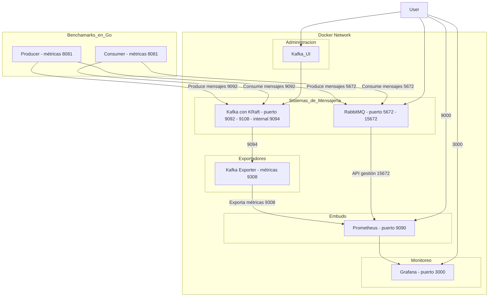

# Proyecto de Pruebas de Rendimiento para Apache Kafka y RabbitMQ

Este proyecto permite ejecutar pruebas de rendimiento (benchmarks) para mi tema de tesis **"Analisis Comparativo de los sistemas de mensajería Apache Kafka  y RabbitMQ para el manejo de grandes volúmenes de datos"**. 

Se proporciona un entorno de pruebas basado en docker para la producción, consumo de mensajes y la recolección de métricas. También se incluyen configuraciones para la creación automática de contenedores que facilitan la ejecución de las pruebas en un entorno aislado y replicable.



**Explicación:**

- **Clientes:**
  - **Producer** y **Consumer**: Aplicaciones que producen y consumen mensajes. Exponen métricas en el puerto **8081**, que son recolectadas por Prometheus.
  - **Interacción con sistemas de mensajería:**
    - Kafka: Envío y recepción de mensajes a través del puerto **9092**.
    - RabbitMQ: Envío y recepción de mensajes a través del puerto **5672**.

- **Sistemas de Mensajería:**
  - **Kafka con KRaft**: Opera sin Zookeeper, utilizando KRaft para la coordinación. Escucha en el puerto **9092** para comunicaciones con los clientes.
  - **RabbitMQ**: Servidor de mensajería que escucha en el puerto **5672** para conexiones AMQP de clientes.

- **Exportadores:**
  - **KafkaExporter**:
    - Recopila métricas de Kafka a través del puerto JMX **9108**.
    - Expone métricas en el puerto **9308** para que Prometheus las consuma.
  - **RabbitMQExporter**:
    - Recopila métricas de RabbitMQ utilizando la API de gestión en el puerto **15672**.
    - Expone métricas en el puerto **9419** para Prometheus.

- **Monitoreo:**
  - **Prometheus**: Sistema de monitoreo que recopila métricas de:
    - **Clientes**: A través del puerto **8081**.
    - **KafkaExporter**: A través del puerto **9308**.
    - **RabbitMQExporter**: A través del puerto **9419**.

**Puertos Utilizados:**

- **Producer y Consumer (Clientes):**
  - Comunicación con **Kafka**: Puerto **9092**.
  - Comunicación con **RabbitMQ**: Puerto **5672**.
  - Exposición de métricas: Puerto **8081**.

- **Kafka con KRaft:**
  - Recepción y envío de mensajes: Puerto **9092**.
  - Métricas JMX (para KafkaExporter): Puerto **9108**.

- **RabbitMQ:**
  - Conexiones AMQP de clientes: Puerto **5672**.
  - API de gestión (para RabbitMQExporter): Puerto **15672**.

- **KafkaExporter:**
  - Recolección de métricas JMX de Kafka: Puerto **9108**.
  - Exposición de métricas para Prometheus: Puerto **9308**.

- **RabbitMQExporter:**
  - Recolección de métricas de RabbitMQ: Puerto **15672**.
  - Exposición de métricas para Prometheus: Puerto **9419**.

- **Prometheus:**
  - Recopila métricas de:
    - **Clientes** en el puerto **8081**.
    - **KafkaExporter** en el puerto **9308**.
    - **RabbitMQExporter** en el puerto **9419**.

**Notas Adicionales:**

- **Kafka con KRaft**: A partir de las versiones recientes, Kafka puede funcionar sin Zookeeper, utilizando KRaft como su propio sistema de coordinación y consenso.
- **Interacción de los Exportadores**: Los exportadores de Kafka y RabbitMQ son herramientas que extraen métricas específicas de cada sistema y las exponen en un formato que Prometheus puede recolectar.
- **Clientes Exponiendo Métricas**: Tanto el productor como el consumidor exponen sus propias métricas (como tasa de mensajes procesados, latencia, etc.) en el puerto **8081**, lo cual es útil para un monitoreo detallado de las pruebas de rendimiento.

**Resumen del Flujo de Datos:**

1. **Producción y Consumo de Mensajes:**
   - Los **clientes** producen y consumen mensajes a través de **Kafka** y **RabbitMQ** utilizando sus respectivos puertos de comunicación.
2. **Recolección de Métricas:**
   - **KafkaExporter** y **RabbitMQExporter** recopilan métricas de **Kafka** y **RabbitMQ** y las exponen para **Prometheus**.
   - Los **clientes** también exponen métricas directamente para **Prometheus**.
3. **Monitoreo:**
   - **Prometheus** recopila todas las métricas expuestas para permitir análisis y visualización del rendimiento del sistema completo.

## Tabla de Contenidos

1. [Estructura del Proyecto](#estructura-del-proyecto)
2. [Requisitos Previos](#requisitos-previos)
3. [Configuración](#configuración)
4. [Ejecución del Software](#ejecución-del-software)
5. [Componentes](#componentes)
   - [Directorio `client`](#directorio-client)
   - [Directorio `monitoring`](#directorio-monitoring)
   - [Directorio `test`](#directorio-test)
6. [Métricas y Monitoreo](#métricas-y-monitoreo)
7. [Resolución de Problemas](#resolución-de-problemas)
8. [Contribuciones](#contribuciones)

---

## Estructura del Proyecto

El proyecto contiene los siguientes directorios y archivos clave:

```plaintext
.
├── client               # Código fuente del cliente que genera y consume mensajes
│   ├── config.yaml      # Configuración de cliente para Kafka y RabbitMQ
│   ├── Dockerfile       # Dockerfile para construir la imagen del cliente
│   ├── go.mod           # Definición de módulo de Go y dependencias
│   ├── go.sum           # Checksum de dependencias
│   ├── hardware         # Protobuf de dispositivos
│   ├── kafka            # Código del cliente Kafka (productor y consumidor)
│   ├── main.go          # Archivo principal de ejecución del cliente
│   ├── metrics          # Código para recolectar y exponer métricas
│   ├── rabbitmq         # Código del cliente RabbitMQ (productor y consumidor)
│   ├── rstreams         # Cliente de RabbitMQ Streams
│   └── utils            # Utilidades generales para el cliente
├── kafka.properties     # Configuración de Kafka
├── monitoring           # Archivos YAML para monitorear los clientes de Kafka y RabbitMQ
├── rabbitmq-env.conf    # Configuración de entorno de RabbitMQ
└── test                 # Archivos de configuración y prueba YAML para Kafka y RabbitMQ
```

## Requisitos Previos

1. **Docker**: Asegúrate de que Docker esté instalado y en funcionamiento.
2. **Go**: Versión 1.20 o superior para compilar y ejecutar el cliente.
3. **Protocolo de Mensajería**: Apache Kafka y RabbitMQ deben estar instalados y configurados. Estos servicios se pueden ejecutar en contenedores Docker o en tu entorno local.

## Configuración

### Variables de Entorno

Antes de ejecutar el proyecto, establece las siguientes variables de entorno:

- `CLIENT`: Define el protocolo de mensajería a utilizar (`kafka`, `rabbitmq`, `rabbitmq-streams`).
- `HOSTNAME`: Nombre del host o IP donde están ejecutándose los servicios de Kafka o RabbitMQ.

### Archivos de Configuración

1. **`client/config.yaml`**: Configuración general para el cliente, incluyendo puertos, detalles de conexión, y nombres de tópicos o colas.
2. **`kafka.properties`** y **`rabbitmq-env.conf`**: Configuraciones para los servicios de Kafka y RabbitMQ.

Ejemplo de `config.yaml`:

```yaml
port: 8081
test:
  requestDelayMs: 10
rabbitmq:
  user: username
  password: password
  queue: devices
  port: 5672
  host: broker-host
kafka:
  version: 3.7.1
  topic: benchmark_topic
  group: my-consumer-group
  host: broker-host:9092
```

## Ejecución del Software

### Construir la Imagen Docker del Cliente

El Dockerfile en `client/Dockerfile` permite construir la imagen para el cliente. Desde el directorio `client`, ejecuta:

```bash
docker build -t my-client-image .
```

### Ejecutar el Cliente de Pruebas

Puedes ejecutar el cliente en un contenedor Docker o directamente en tu máquina local.

#### Opción 1: Ejecución en Docker

```bash
docker run --rm -e CLIENT=kafka -e HOSTNAME=localhost -v "$(pwd)/config.yaml:/app/config.yaml" my-client-image
```

#### Opción 2: Ejecución Local

```bash
cd client/
go run main.go
```

## Componentes

### Directorio `client`

Contiene el código fuente del cliente que genera y consume mensajes en Kafka y RabbitMQ. Aquí están los subcomponentes principales:

- **`kafka/`**: Implementación del productor y consumidor de mensajes en Kafka.
- **`rabbitmq/`**: Implementación del productor y consumidor de mensajes en RabbitMQ.
- **`utils/`**: Funciones de utilidad.
- **entorno_pruebas/**: Incluye la receta para docker-compose y la configuración de prometheus

### Directorio `monitoring`

Contiene configuraciones para monitorear la actividad de los clientes de Kafka y RabbitMQ.

- **`kafka-client.yaml`**: Define los parámetros para el cliente de Kafka.
- **`rabbitmq-client.yaml`**: Define los parámetros para el cliente de RabbitMQ.

Ambos archivos usan Kubernetes Jobs para ejecutar y monitorear las pruebas de rendimiento.

### Directorio `test`

Este directorio contiene archivos de configuración YAML utilizados para ejecutar y parametrizar las pruebas en Kafka y RabbitMQ. Estos archivos pueden crear contenedores y configurar los tests.

- **`0-config.yaml`**: Configuración general para las pruebas.
- **`1-kafka-client.yaml`**: Configuración específica para el cliente de Kafka.
- **`2-rabbitmq-client.yaml`**: Configuración específica para el cliente de RabbitMQ.

## Métricas y Monitoreo

El sistema está diseñado para recolectar métricas que se exponen a través de un servidor Prometheus en el puerto especificado en `config.yaml`. Estas métricas se pueden usar para evaluar el rendimiento del cliente durante las pruebas.

### Ejemplo de Métricas Recolectadas

- **Latencia de Producción y Consumo**
- **Tamaño de Mensaje**
- **Errores de Conexión**

Estas métricas pueden ser visualizadas en Prometheus o Grafana.

## Resolución de Problemas

1. **Error `dial tcp: lookup broker: no such host`**: Verifica que el nombre del host `broker` esté correctamente configurado en `config.yaml` o intenta usar una dirección IP.
2. **Problemas con Docker**: Asegúrate de que Docker esté ejecutándose y que no haya conflictos de red.
3. **Compilación de Protobuf**: Si realizas cambios en `hardware/device.proto`, regenera los archivos Go usando `protoc`.

## Contribuciones

1. Haz un fork de este repositorio.
2. Crea una nueva rama (`feature/nueva-funcionalidad`).
3. Realiza los cambios y crea un pull request.

## Ejecución

Para ejecutar correctamente el proyecto, es importante seguir un orden específico para iniciar cada sistema y servicio que participa en la prueba de benchmarking. A continuación, se describe cada sistema involucrado, su propósito en la arquitectura y las instrucciones para ejecutarlos en el orden adecuado.

### Sistemas Involucrados

1. **Kafka con KRaft**: Plataforma de mensajería distribuida utilizada para pruebas de rendimiento. Funciona sin Zookeeper y escucha en el puerto `9092` para enviar y recibir mensajes.
2. **RabbitMQ**: Sistema de mensajería utilizado como alternativa a Kafka en las pruebas de rendimiento. Escucha en el puerto `5672` para comunicación de clientes y expone una interfaz de administración en el puerto `15672`.
3. **Kafka Exporter**: Herramienta para recopilar métricas de Kafka y exponerlas en el puerto `9308` en un formato que Prometheus puede recolectar.
4. **RabbitMQ Exporter**: Exportador de métricas para RabbitMQ que recopila datos del sistema y los expone en el puerto `9419` para Prometheus.
5. **Prometheus**: Sistema de monitoreo que recopila métricas de Kafka, RabbitMQ, Kafka Exporter, RabbitMQ Exporter y los propios clientes (producer y consumer) para un análisis detallado del rendimiento.

### Orden de Ejecución de los Sistemas

Sigue los pasos detallados a continuación para iniciar cada sistema en el orden correcto.

---

### Paso 1: Iniciar Kafka con KRaft

1. Asegúrate de que Kafka esté configurado para usar KRaft y no Zookeeper. La configuración necesaria se encuentra en el archivo `kafka.properties`.
2. Si tienes Docker, crea un contenedor de Kafka usando el siguiente comando (asumiendo que tienes un `docker-compose.yml` configurado):

   ```yaml
   version: '3.8'

   services:
     kafka:
       image: confluentinc/confluent-local:latest
       environment:
         KAFKA_BROKER_ID: 1
         KAFKA_LISTENER_SECURITY_PROTOCOL_MAP: PLAINTEXT:PLAINTEXT
         KAFKA_ADVERTISED_LISTENERS: PLAINTEXT://kafka:9092
         KAFKA_LISTENERS: PLAINTEXT://0.0.0.0:9092
         KAFKA_PROCESS_ROLES: broker,controller
         KAFKA_CONTROLLER_QUORUM_VOTERS: 1@kafka:9093
         KAFKA_NODE_ID: 1
       ports:
         - "9092:9092"
   ```

3. Ejecuta el contenedor con `docker-compose`:

   ```bash
   docker-compose up -d kafka
   ```

4. Asegúrate de que Kafka esté corriendo y que el puerto `9092` esté accesible para el cliente.

---

### Paso 2: Iniciar RabbitMQ

1. Inicia un contenedor de RabbitMQ con la imagen `rabbitmq:3-management` para incluir la interfaz de administración en el puerto `15672`:

   ```yaml
   services:
     rabbitmq:
       image: rabbitmq:3-management
       environment:
         RABBITMQ_DEFAULT_USER: usuario
         RABBITMQ_DEFAULT_PASS: contraseña
       ports:
         - "5672:5672"   # Puerto AMQP para clientes
         - "15672:15672" # Puerto de administración
   ```

2. Ejecuta el contenedor:

   ```bash
   docker-compose up -d rabbitmq
   ```

3. Confirma que RabbitMQ está activo y accesible en los puertos `5672` y `15672`.

---

### Paso 3: Iniciar Kafka Exporter

1. Inicia el contenedor de Kafka Exporter para exponer las métricas de Kafka a través del puerto `9308`:

   ```yaml
   services:
     kafka_exporter:
       image: danielqsj/kafka-exporter:latest
       environment:
         KAFKA_SERVER: "kafka:9092"
       ports:
         - "9308:9308"
       depends_on:
         - kafka
   ```

2. Ejecuta Kafka Exporter:

   ```bash
   docker-compose up -d kafka_exporter
   ```

3. Asegúrate de que el puerto `9308` esté accesible para Prometheus.

---

### Paso 4: Iniciar RabbitMQ Exporter

1. Inicia el contenedor de RabbitMQ Exporter para recopilar métricas del sistema RabbitMQ y exponerlas en el puerto `9419`:

   ```yaml
   services:
     rabbitmq_exporter:
       image: kbudde/rabbitmq-exporter:latest
       environment:
         RABBITMQ_DEFAULT_USER: usuario
         RABBITMQ_DEFAULT_PASS: contraseña
         RABBITMQ_URL: "http://rabbitmq:15672"
       ports:
         - "9419:9419"
       depends_on:
         - rabbitmq
   ```

2. Ejecuta RabbitMQ Exporter:

   ```bash
   docker-compose up -d rabbitmq_exporter
   ```

3. Confirma que el puerto `9419` esté accesible para Prometheus.

---

### Paso 5: Iniciar Prometheus

1. Configura Prometheus para recolectar métricas de Kafka Exporter, RabbitMQ Exporter y los clientes. Agrega el siguiente `scrape_config` en el archivo de configuración de Prometheus:

   ```yaml
   scrape_configs:
     - job_name: 'benchmark-client'
       static_configs:
         - targets: ['localhost:8081']  # Clientes Producer y Consumer

     - job_name: 'kafka-exporter'
       static_configs:
         - targets: ['localhost:9308'] # Kafka Exporter

     - job_name: 'rabbitmq-exporter'
       static_configs:
         - targets: ['localhost:9419'] # RabbitMQ Exporter
   ```

2. Inicia Prometheus (si está en un contenedor, asegúrate de que el archivo de configuración esté correctamente montado):

   ```bash
   docker run -d --name prometheus \
     -p 9090:9090 \
     -v /path/to/prometheus.yml:/etc/prometheus/prometheus.yml \
     prom/prometheus
   ```

3. Verifica que Prometheus esté activo y listo para recopilar métricas en el puerto `9090`.

---

### Paso 6: Configurar y Ejecutar el Cliente (Producer y Consumer)

Antes de ejecutar el cliente principal, asegúrate de que todos los sistemas anteriores estén en ejecución. Luego sigue estos pasos para iniciar el cliente:

1. **Configurar Variables de Entorno**:
   
   Asegúrate de que las siguientes variables de entorno estén configuradas según el tipo de cliente que deseas probar, si no se configuran se tomaran valores por defecto:

   ```bash
   export CLIENT=kafka       # Puede ser "kafka", "rabbitmq"
   # Configuración para Kafka
   export kafka_rate=10000
   export kafka_increment=1000
   export kafka_testDuration=2
   export kafka_messageSize=10240
   
   # Configuración para RabbitMQ
   export rabbitmq_rate=10000
   export rabbitmq_increment=1000
   export rabbitmq_testDuration=2
   export rabbitmq_messageSize=10240
   export rabbitmq_consumer_testDuration=120
   
   ```
   
2. **Ejecutar el Cliente**:

   Desde el directorio `client/`, puedes ejecutar el cliente directamente desde el código fuente si tienes Go instalado:

   ```bash
   go run main.go
   ```

   O, si prefieres utilizar Docker, puedes ejecutar el cliente en un contenedor:

   ```bash
   docker run --rm \
     -e CLIENT=kafka \
     -e HOSTNAME=$(hostname) \
     -v $(pwd)/config.yaml:/app/config.yaml \
     benchmark-client
   ```

---

### Resumen de la Ejecución en Orden

1. **Iniciar Kafka con KRaft** en el puerto `9092`.
2. **Iniciar RabbitMQ** en los puertos `5672` (para clientes) y `15672` (interfaz de administración).
3. **Iniciar Kafka Exporter** en el puerto `9308` para exponer métricas de Kafka.
4. **Iniciar RabbitMQ Exporter** en el puerto `9419` para exponer métricas de RabbitMQ.
5. **Iniciar Prometheus** para recolectar métricas de Kafka Exporter, RabbitMQ Exporter y los clientes en el puerto `9090`.
6. **Configurar y Ejecutar el Cliente** (Producer y Consumer) en el puerto `8081` para exponer métricas para Prometheus.

Con este flujo de ejecución y los sistemas configurados en el orden correcto, el cliente estará listo para realizar las pruebas de rendimiento en Kafka y RabbitMQ, mientras que Prometheus recopilará las métricas expuestas para análisis de rendimiento y monitoreo.

### Créditos al autor orginal

El autor original ejecutaba los test en la nube, el software fue modificado para realizar los test en local.

https://github.com/antonputra/tutorials/tree/218/lessons/218/client